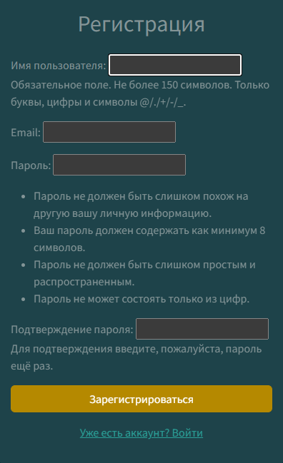
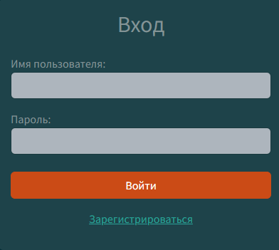
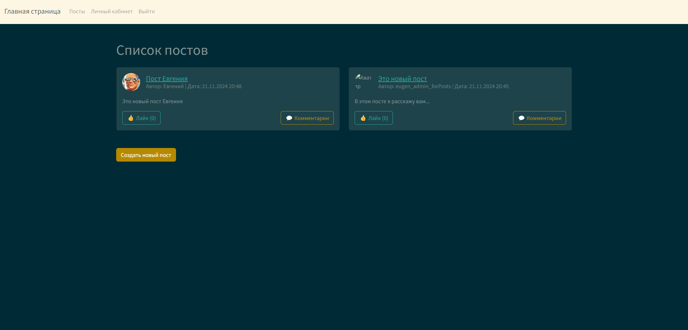
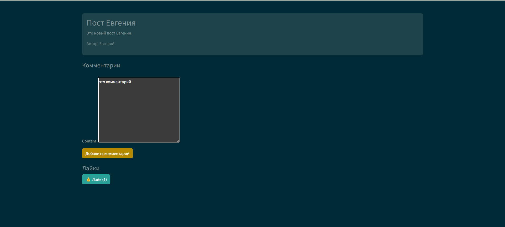
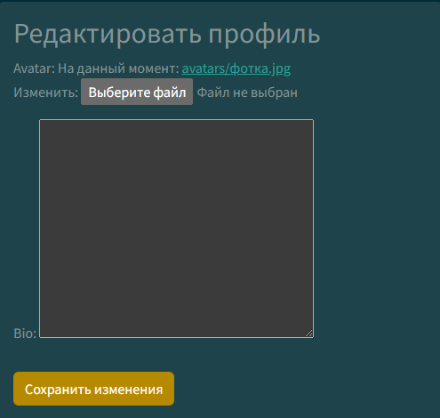

# Django Project

## Обзор проекта

Проект представляет собой веб-приложение для управления пользователями и создания постов. Пользователи могут регистрироваться, входить в систему, просматривать и управлять своими профилями, а также создавать и просматривать посты. Интерфейс построен с использованием шаблонов Django и CSS для стилизации.

## Основные возможности

- Регистрация и авторизация пользователей.
- Управление профилем пользователя.
- Создание, редактирование и удаление постов.
- Отображение списка постов.
- Добавление комментариев и лайков к постам.


## Установка и запуск

1. Клонируйте репозиторий:
   ```bash
   git clone https://github.com/username/django_project.git
   ```

2. Установите зависимости:
   ```bash
   pip install -r requirements.txt
   ```

3. Выполните миграции базы данных:
   ```bash
   python manage.py migrate
   ```

4. Запустите сервер:
   ```bash
   python manage.py runserver
   ```

5. Откройте в браузере:
   ```
   http://127.0.0.1:8000
   ```

## Использование

### 1. Регистрация и вход

- **Регистрация**: Форма для создания нового аккаунта.  
  

- **Вход**: Форма для авторизации пользователя.  
  

### 2. Список постов

Пользователь может просмотреть список доступных постов.  


### 3. Управление постами

Пользователь может добавлять комментарии и лайки к постам.  


### 4. Личный кабинет

Личный кабинет отображает информацию о пользователе и позволяет её редактировать.  


### 5. Редактирование профиля

Пользователь может изменить свой аватар, описание и другие данные.  


## Структура проекта
```
my_django_project/
│
├── myproject/
│   ├── __init__.py
│   ├── asgi.py
│   ├── settings.py
│   ├── urls.py
│   └── wsgi.py
│
├── static/
│
├── users/
│   ├── migrations/
│   │   └── 0001_initial.py
│   │
│   ├── templates/
│   │   ├── registration/
│   │   │   └── login.html
│   │   └── users/
│   │       ├── home.html
│   │       ├── logged_out.html
│   │       ├── navbar.html
│   │       ├── post_detail.html
│   │       ├── post_form.html
│   │       ├── post_list.html
│   │       ├── profile.html
│   │       └── register.html
│
├── db.sqlite3
├── manage.py
└── requirements.txt
```